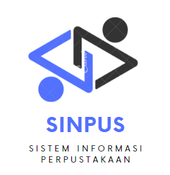

## Deskripsi
Sistem Informasi Perpustakaan (SINPUS) merupakan sistem informasi yang dikembangkan untuk memudahkan dalam pelayanan serta memudahkan petugas perpustakaan dalam mengelola perpustakaan. Petugas perpustakaan dapat selalu memonitor tentang ketersediaan buku, daftar buku baru, peminjaman buku dan pengembalian buku.

## Tech Stack
&nbsp;
&nbsp;
&nbsp;
&nbsp;

## Role 
 - Admin [1]
 - Student [2]